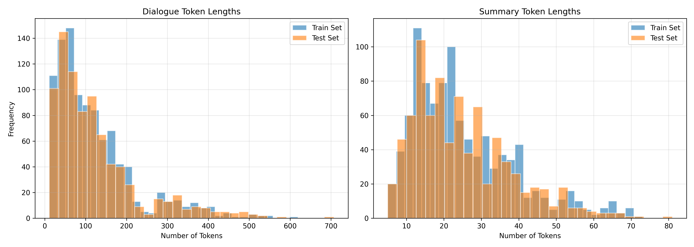
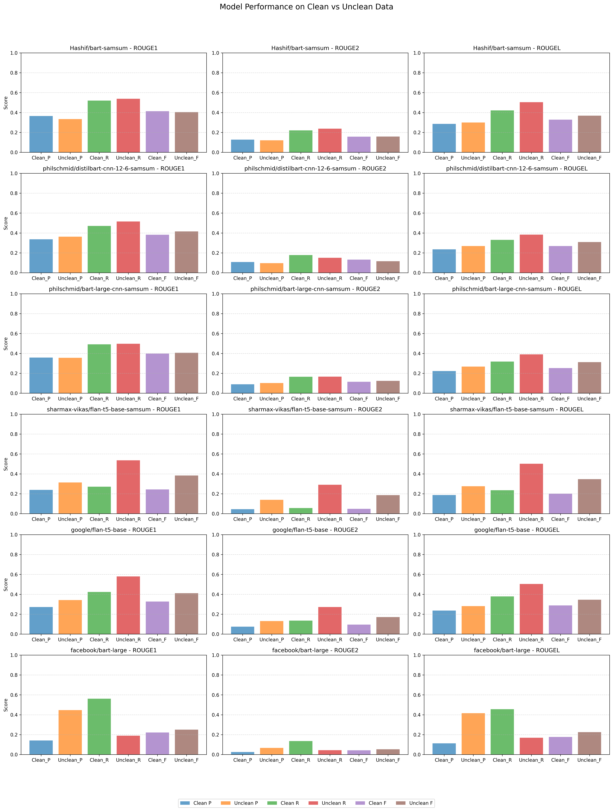

# Text Summarization Pipeline

This project provides a modular pipeline for evaluating and comparing different text summarization models using the Hugging Face ecosystem. It allows for data loading, optional cleaning, model inference, evaluation using ROUGE metrics, and visualization of results.

**A detailed report of this project is available in the file [`results/summarisation_pipeline.pdf`](results/summarisation_pipeline.pdf).**

## Features

-   **Multiple Model Comparison**: Evaluate and compare several pre-trained summarization models from Hugging Face Hub (configurable in `config.py`).
-   **Modular Design**: Components for data loading (`data_loader.py`), cleaning (`data_cleaner.py`), model inference (`model.py`), evaluation (`evaluator.py`), and visualization (`visualization.py`) are separated for clarity and extensibility.
-   **Configurable Pipeline**: Centralized configuration (`config.py`) using dataclasses for easy management of model names, generation parameters, dataset details, logging, and processing options.
-   **Data Cleaning Option**: Includes an optional data cleaning step (`data_cleaner.py`) which can be toggled in the configuration.
-   **Comprehensive Evaluation**:
    -   Calculates ROUGE-1, ROUGE-2, and ROUGE-L scores.
    -   Compares model performance on both original ("Unclean") and cleaned ("Clean") data.
    -   Saves detailed scores to a CSV file (`results/summarization_scores.csv`).
-   **Visualization**:
    -   Generates plots comparing model performance for clean and unclean data (`plots/clean/model_comparison.png`, `plots/unclean/model_comparison.png`).
    -   Generates a plot comparing overall performance across models between clean and unclean data (`plots/clean_vs_unclean_model_performance_comparison.png`).
    -   (Optional, if run standalone) Plots token length distributions (`plots/token_distributions.png`).
    -   Displays example dialogue/summary pairs alongside generated summaries.
-   **Production-Ready**: Incorporates logging, error handling, and type hints.

## Architecture

The pipeline follows a clear sequence:

1.  **Configuration (`config.py`)**: Defines all parameters, including models to test, dataset, generation settings, and flags like `CLEAN_DATA`.
2.  **Data Loading (`data_loader.py`)**: Loads the specified dataset (e.g., "Samsung/samsum") using `datasets`. Optionally cleans the data using `DataCleaner`. Can also perform token analysis if run separately.
3.  **Pipeline Orchestration (`pipeline.py`)**:
    -   Iterates through data cleaning options (True/False).
    -   For each option, loads data using `DataLoader`.
    -   Iterates through the list of models defined in `config.MODEL_NAMES`.
    -   Loads the current model using `SummarizationModel`.
    -   Generates summaries for the test set.
    -   Evaluates generated summaries against references using `SummarizationEvaluator` (ROUGE scores).
    -   Uses `SummaryVisualizer` to create comparison plots and display examples.
    -   Collects all results.
4.  **Model Inference (`model.py`)**: Uses `transformers.pipeline` (or `AutoModelForSeq2SeqLM` and `AutoTokenizer`) to load and run the summarization models specified in the config.
5.  **Evaluation (`evaluator.py`)**: Computes ROUGE metrics using the `evaluate` library (likely, based on Hugging Face ecosystem standards).
6.  **Visualization (`visualization.py`)**: Uses libraries like Matplotlib/Seaborn (inferred) to generate plots comparing model performance and display text examples.
7.  **Main Entry Point (`main.py`)**: Sets up logging, instantiates the `SummarizationPipeline`, runs it (optionally with a `sample_size`), and prints the formatted evaluation results to the console.

## Project Structure

```
.
├── .env                  # Environment variables (e.g., HF_TOKEN) - Optional
├── .gitignore
├── config.py             # Central configuration
├── data_cleaner.py       # Text cleaning logic
├── data_loader.py        # Data loading and analysis
├── evaluator.py          # Evaluation metric calculation
├── main.py               # Main script to run the pipeline
├── model.py              # Summarization model loading and inference
├── pipeline.py           # Pipeline orchestration logic
├── requirements.txt      # Project dependencies
├── tuner.py              # (Assumed) Hyperparameter tuning logic
├── visualization.py      # Results visualization and plotting
├── notebooks/            # Directory for experimental notebooks
├── plots/                # Output directory for generated plots
│   ├── clean/
│   │   └── model_comparison.png
│   ├── unclean/
│   │   └── model_comparison.png
│   └── clean_vs_unclean_model_performance_comparison.png
└── results/              # Output directory for evaluation scores
    └── summarization_scores.csv
```

## Setup

### Prerequisites

-   Python 3.8+
-   `pip` package manager
-   Git

### Installation

1.  **Clone the repository:**
    ```bash
    git clone https://github.com/Hash-if-vs/summarisation_pipeline
    cd summarisation_pipeline
    ```

2.  **Create and activate a virtual environment (Recommended):**
    ```bash
    python -m venv .venv
    source .venv/bin/activate  # On Windows use `.venv\Scripts\activate`
    ```

3.  **Install dependencies:**
    ```bash
    pip install -r requirements.txt
    ```

4.  **Install the `en_core_web_sm` model for spaCy :**
    ```bash
    python -m spacy download en_core_web_sm
    ```

## Configuration

Modify `config.py` to customize the pipeline:

-   `MODEL_NAMES`: List of Hugging Face model identifiers to evaluate.
-   `SELECTED_MODEL_INDEX`: Default model index (primarily used if running `model.py` directly, the pipeline iterates through all).
-   `MAX_INPUT_LENGTH`, `MAX_OUTPUT_LENGTH`, `NUM_BEAMS`: Generation parameters.
-   `DATASET_NAME`: The Hugging Face dataset identifier (e.g., "Samsung/samsum").
-   `CLEAN_DATA`: Set to `True` to enable data cleaning, `False` to disable. The pipeline runs both scenarios by default.
-   `LOG_LEVEL`, `LOG_FORMAT`: Logging configuration.

## Usage

To run the full pipeline evaluating all configured models on both clean and unclean data:

```bash
python main.py
```

The script will:
-   Load the data.
-   Run the pipeline once with `CLEAN_DATA=True`.
-   Run the pipeline again with `CLEAN_DATA=False`.
-   Generate summaries for each model on the test set (or a sample if modified).
-   Calculate and print ROUGE scores for each model and data condition.
-   Save detailed scores to `results/summarization_scores.csv`.
-   Save comparison plots to the `plots/` directory.
-   Print final formatted results to the console.

*Note: The `pipeline.run()` method in `main.py` currently uses a default `sample_size=500`. Modify this in `main.py` if you want to run on the full dataset (set to `None`) or a different sample size.*

## Summarization Scores

The table below shows the ROUGE scores for different models on both clean and unclean data:

| Data Type | Model Name                              | ROUGE-1 Precision | ROUGE-1 Recall | ROUGE-1 F1 | ROUGE-2 Precision | ROUGE-2 Recall | ROUGE-2 F1 | ROUGE-L Precision | ROUGE-L Recall | ROUGE-L F1 |
|-----------|-----------------------------------------|-------------------|----------------|------------|-------------------|----------------|------------|-------------------|----------------|------------|
| Clean     | Hashif/bart-samsum                     | 0.3658            | 0.5198         | 0.4132     | 0.1275            | 0.2207         | 0.1570     | 0.2866            | 0.4216         | 0.3285     |
| Clean     | philschmid/distilbart-cnn-12-6-samsum  | 0.3368            | 0.4702         | 0.3821     | 0.1084            | 0.1780         | 0.1322     | 0.2358            | 0.3304         | 0.2685     |
| Clean     | philschmid/bart-large-cnn-samsum       | 0.3580            | 0.4911         | 0.3983     | 0.0897            | 0.1657         | 0.1155     | 0.2226            | 0.3185         | 0.2533     |
| Clean     | sharmax-vikas/flan-t5-base-samsum      | 0.2395            | 0.2708         | 0.2432     | 0.0452            | 0.0568         | 0.0481     | 0.1869            | 0.2351         | 0.2006     |
| Clean     | google/flan-t5-base                    | 0.2719            | 0.4236         | 0.3277     | 0.0752            | 0.1354         | 0.0959     | 0.2372            | 0.3790         | 0.2887     |
| Clean     | facebook/bart-large                    | 0.1416            | 0.5615         | 0.2222     | 0.0251            | 0.1354         | 0.0422     | 0.1124            | 0.4563         | 0.1773     |
| Unclean   | Hashif/bart-samsum                     | 0.3347            | 0.5386         | 0.4036     | 0.1209            | 0.2382         | 0.1587     | 0.3002            | 0.5041         | 0.3692     |
| Unclean   | philschmid/distilbart-cnn-12-6-samsum  | 0.3632            | 0.5153         | 0.4162     | 0.0970            | 0.1511         | 0.1158     | 0.2692            | 0.3836         | 0.3091     |
| Unclean   | philschmid/bart-large-cnn-samsum       | 0.3560            | 0.4966         | 0.4065     | 0.1021            | 0.1672         | 0.1247     | 0.2680            | 0.3906         | 0.3121     |
| Unclean   | sharmax-vikas/flan-t5-base-samsum      | 0.3141            | 0.5364         | 0.3835     | 0.1389            | 0.2907         | 0.1857     | 0.2756            | 0.5019         | 0.3472     |
| Unclean   | google/flan-t5-base                    | 0.3420            | 0.5802         | 0.4111     | 0.1315            | 0.2723         | 0.1717     | 0.2812            | 0.5041         | 0.3462     |
| Unclean   | facebook/bart-large                    | 0.4464            | 0.1894         | 0.2504     | 0.0667            | 0.0444         | 0.0533     | 0.4161            | 0.1686         | 0.2257     |

## Qualitative Analysis

For a deeper qualitative analysis of the summarization models, a Jupyter Notebook is provided in the `notebooks/` directory. This notebook contains code to analyze and compare the generated summaries with the reference summaries in detail.

### Running the Notebook

1. Ensure you have installed all dependencies as mentioned in the [Setup](#setup) section.
2. Navigate to the `notebooks/` directory:
    ```bash
    cd notebooks
    ```
3. Launch Jupyter Notebook:
    ```bash
    jupyter notebook
    ```
4. Open the qualitative analysis notebook and follow the instructions provided within the notebook.

This notebook allows you to:
- View example dialogue/summary pairs alongside generated summaries.
- Perform a detailed comparison of the generated summaries for different models.

## Dataset Analysis

To analyze the dataset (e.g., token length distributions, data cleaning effects), run the `data_loader.py` script. This script generates plots and statistics to help understand the dataset better.

### Running the Data Analysis

Run the following command:
```bash
python data_loader.py
```

### Sample Outputs

The script generates the following outputs in the `plots/` directory:
- **Token Length Distributions**: `plots/token_distributions.png`
- **Clean vs. Unclean Data Comparison**: Plots showing the effect of data cleaning.

Example output:
- **Token Length Distribution Plot**:
  

- **Clean vs. Unclean Data Comparison**:
  

## Fine-Tuning a Custom BART Model

This project includes a custom fine-tuned BART model on the SAMSum dataset. The fine-tuning process is provided in the Jupyter Notebook located in the `notebooks/` directory, named `finetune_summarisation.ipynb`. It is recommended to run this notebook in a Google Colab environment for ease of use and access to GPU resources.

### Running the Fine-Tuning Notebook

1. Open the `notebooks/finetune_summarisation.ipynb` file in Google Colab.
2. Obtain your API token from [Hugging Face](https://huggingface.co/settings/tokens).
3. Add the token to Colab secrets:
    - In the Colab interface, go to the **Sidebar** on the left.
    - Click on the **"Secrets"** tab.
    - Add a new secret with the key `HF_TOKEN` and paste your Hugging Face API token as the value.
4. Follow the instructions in the notebook to fine-tune the BART model on the SAMSum dataset.

### Notes:
- Ensure you have a Hugging Face account and API token to access the Hugging Face Hub.
- The fine-tuned model can be saved to your Hugging Face account for later use in the pipeline.

## Design Choices

-   **Modularity**: Separating concerns into different files (`data_loader`, `model`, `evaluator`, etc.) makes the codebase easier to understand, maintain, and extend. New models, datasets, or evaluation metrics can be added with minimal changes to the core pipeline.
-   **Configuration-Driven**: Using a central `config.py` with a `dataclass` allows for easy modification of parameters without digging into the code. It also provides type safety.
-   **Hugging Face Ecosystem**: Leveraging `datasets`, `transformers`, and `evaluate` (inferred) simplifies tasks like data loading, model handling, and metric calculation, allowing focus on the pipeline logic.
-   **Comparative Analysis**: The pipeline is explicitly designed to compare multiple models and the effect of data cleaning, providing valuable insights through direct evaluation and visualization.
-   **Reproducibility**: Storing results (CSV) and visualizations (plots) ensures that experiments can be documented and reproduced.

