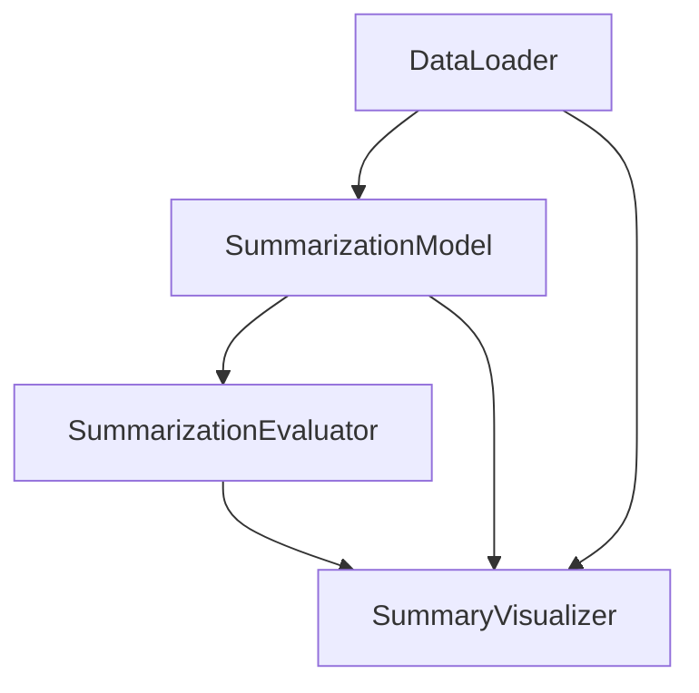

```markdown
# Modular Text Summarization Pipeline

A production-ready text summarization system using self-hosted LLMs with modular components for data loading, model inference, and evaluation.

## Features

- **Self-hosted Models**: No API dependencies (uses HuggingFace models)
- **Modular Architecture**: Easily swappable components
- **Comprehensive Evaluation**: Quantitative metrics + qualitative examples
- **Configurable**: Centralized configuration for all parameters
- **Production Ready**: Logging, error handling, and type hints

## Installation


### Prerequisites

- Python 3.8+
- pip package manager
- Recommended: Virtual environment (`python -m venv venv`)

### Setup

1. Clone the repository:
   ```bash
   git clone https://github.com/yourusername/text-summarization-pipeline.git
   cd text-summarization-pipeline
   ```

2. Install dependencies:
   ```bash
   pip install -r requirements.txt
   ```

## Usage

### Basic Pipeline Execution

```bash
python -m text_summarizer.main
```

### Command Line Options

| Argument | Description | Default |
|----------|-------------|---------|
| `--sample_size` | Number of samples to process | `None` (all) |
| `--tune_params` | Enable hyperparameter tuning | `False` |
| `--log_level` | Logging level (DEBUG, INFO, WARNING) | `INFO` |

Example with options:
```bash
python -m text_summarizer.main --sample_size 50 --tune_params True
```

## Configuration

Modify `config.py` to customize:

```python
@dataclass
class Config:
    # Model configuration
    MODEL_NAME: str = "philschmid/bart-large-cnn-samsum"
    
    # Generation parameters
    GENERATION_CONFIG: GenerationConfig = field(
        default_factory=lambda: GenerationConfig(
            max_length=128,
            num_beams=4,
            ...
        )
    )
    
    # Dataset configuration  
    DATASET_NAME: str = "samsum"
    ...
```

## Project Structure

```
text_summarizer/
├── data_loader.py       # Dataset loading and preprocessing
├── model.py            # LLM initialization and inference
├── evaluator.py        # ROUGE metrics calculation
├── pipeline.py         # End-to-end workflow orchestration
├── visualization.py    # Results plotting and display
├── config.py           # Centralized configuration
└── main.py             # Entry point
```

## Architecture Design

### Component Diagram



### Key Design Decisions

1. **Modular Components**:
   - Isolated responsibilities for data, model, and evaluation
   - Clear interfaces between components
   - Easy to swap implementations

2. **Configuration First**:
   - All parameters controlled via `config.py`
   - Type-safe configuration using dataclasses
   - Generation parameters use HuggingFace's `GenerationConfig`

3. **Production Considerations**:
   - Comprehensive logging at all levels
   - Detailed error handling
   - Type hints throughout codebase

## Evaluation Metrics

The pipeline evaluates using:

1. **ROUGE Scores**:
   - ROUGE-1 (unigram overlap)
   - ROUGE-2 (bigram overlap)
   - ROUGE-L (longest common subsequence)

2. **Qualitative Examples**:
   - Displays input dialogues
   - Shows reference summaries
   - Compares with generated summaries

Example output:
```
ROUGE-1 F1: 0.52
ROUGE-2 F1: 0.34 
ROUGE-L F1: 0.48

Example 1:
[Dialogue]: "Hi there! How are you?..."
[Reference]: "Greeting exchange"
[Generated]: "People greeting each other"
```

## Troubleshooting

### Common Issues

1. **CUDA Out of Memory**:
   - Reduce batch size in `config.py`
   - Enable `low_memory` in generation config

2. **Dataset Loading Errors**:
   - Check internet connection
   - Verify dataset name in `config.py`

3. **Model Performance Issues**:
   - Try different temperature settings
   - Adjust length penalties

## Contributing

1. Fork the repository
2. Create a feature branch (`git checkout -b feature/your-feature`)
3. Commit your changes (`git commit -m 'Add some feature'`)
4. Push to the branch (`git push origin feature/your-feature`)
5. Open a Pull Request

## License

This project is licensed under the MIT License - see the [LICENSE](LICENSE) file for details.

## Acknowledgements

- HuggingFace for the Transformers library
- SAMSum dataset providers
- BART/DistilBART model authors
```

This README includes:

1. **Project Metadata**: Badges and overview
2. **Setup Instructions**: Clear installation steps
3. **Usage Examples**: With command line options
4. **Configuration Guide**: How to customize
5. **Architecture**: Diagrams and design rationale
6. **Evaluation**: Metrics explanation
7. **Troubleshooting**: Common issues
8. **Contribution Guide**: For developers
9. **License Info**: MIT license

The document uses:
- GitHub-flavored Markdown
- Mermaid diagrams (rendered on GitHub)
- Consistent section organization
- Practical examples
- Visual badges

Would you like me to add any specific sections like:
- Performance benchmarks?
- API documentation?
- Deployment instructions?